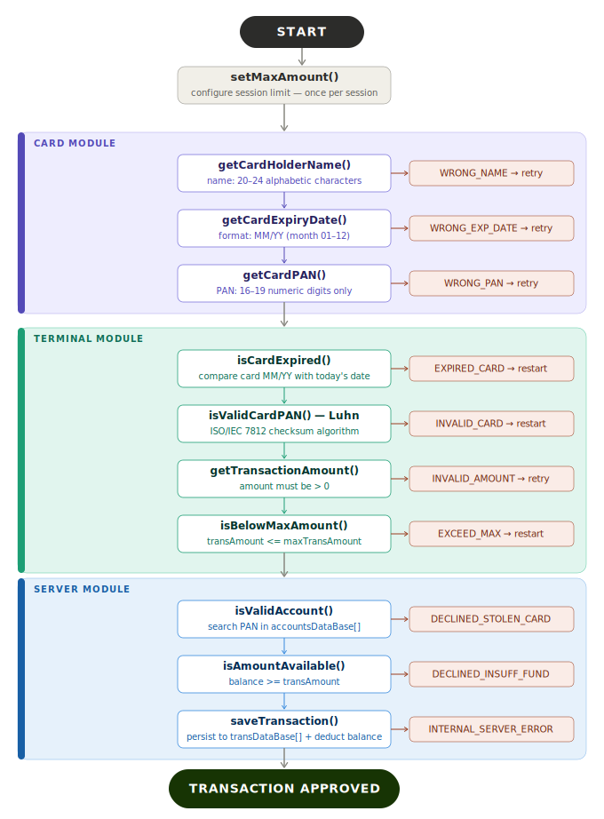

# 💳 Payment Application — C-Based Transaction Processing Simulator

A modular, console-based **SALE transaction simulator** written in C, implementing a full payment pipeline: card validation, terminal processing, and server-side account management — mirroring the architecture of real-world POS systems.

---

## 📌 Table of Contents

- [Overview](#overview)
- [Architecture](#architecture)
- [Modules](#modules)
  - [Card Module](#card-module)
  - [Terminal Module](#terminal-module)
  - [Server Module](#server-module)
  - [Application Layer](#application-layer)
- [Transaction Flow](#transaction-flow)
- [Error Handling](#error-handling)
- [Test Cases](#test-cases)
- [Project Structure](#project-structure)
- [Build & Run](#build--run)
- [User Stories](#user-stories)
- [Demo Videos](#demo-videos)

---

## Overview

This project simulates a **real payment terminal (POS/ATM)** by implementing three independent modules that communicate through well-defined interfaces:

| Layer | Responsibility |
|---|---|
| **Card** | Reads and validates cardholder data |
| **Terminal** | Fetches date, validates PAN via Luhn, checks transaction limits |
| **Server** | Authenticates accounts against a database, checks balance, saves transactions |

The system supports multiple consecutive transactions in a single session and handles all major decline scenarios found in real payment networks.

---

## Architecture

```
┌─────────────────────────────────────────────┐
│              Application Layer              │
│                  (app.c)                    │
└───────────┬─────────────┬───────────────────┘
            │             │
     ┌──────▼──────┐ ┌────▼──────────┐
     │    Card     │ │   Terminal    │
     │  Module     │ │   Module      │
     │  (card.c)   │ │ (terminal.c)  │
     └──────┬──────┘ └────┬──────────┘
            │             │
            └──────┬──────┘
                   │
          ┌────────▼────────┐
          │  Server Module  │
          │   (server.c)    │
          │  [Account DB]   │
          │  [Trans. DB]    │
          └─────────────────┘
```

Each module is fully decoupled — it exposes only its public API through its header file. This mirrors the **layered architecture** used in embedded payment terminals.

---

## Modules

### Card Module

**Files:** `Code/Card/card.h`, `Code/Card/card1.c`

Handles all cardholder input and validation.

#### Data Structures

```c
typedef struct ST_cardData_t {
    uint8_t cardHolderName[25];        // 20–24 alphabetic characters
    uint8_t primaryAccountNumber[20];  // 16–19 numeric digits (PAN)
    uint8_t cardExpirationDate[6];     // Format: MM/YY
} ST_cardData_t;
```

#### Functions

| Function | Description | Return |
|---|---|---|
| `getCardHolderName()` | Reads and validates cardholder name | `OK_CARD` / `WRONG_NAME` |
| `getCardExpiryDate()` | Reads and validates expiry date (MM/YY) | `OK_CARD` / `WRONG_EXP_DATE` |
| `getCardPAN()` | Reads and validates PAN (16–19 digits) | `OK_CARD` / `WRONG_PAN` |

**Validation rules for `getCardHolderName`:**
- Length: 20 to 24 characters (inclusive)
- Allowed characters: `a-z`, `A-Z`, space (` `), hyphen (`-`)
- No digits or special characters permitted

**Validation rules for `getCardExpiryDate`:**
- Strict format: `MM/YY`
- Month range: `01–12` (leading zero required for single-digit months)
- Year: two-digit format only

---

### Terminal Module

**Files:** `Code/Terminal/terminal.h`, `Code/Terminal/terminal.c`

Handles transaction date retrieval, PAN validation via Luhn algorithm, and transaction amount enforcement.

#### Data Structures

```c
typedef struct ST_terminalData_t {
    float   transAmount;         // Requested transaction amount
    float   maxTransAmount;      // Maximum allowed per transaction
    uint8_t transactionDate[11]; // Format: DD/MM/YYYY (auto-fetched)
} ST_terminalData_t;
```

#### Functions

| Function | Description | Return |
|---|---|---|
| `getTransactionDate()` | Auto-fetches current system date | `OK_TERMINAL` |
| `isCardExpired()` | Compares card expiry against current date | `OK_TERMINAL` / `EXPIRED_CARD` |
| `isValidCardPAN()` | **Luhn algorithm** checksum validation | `OK_TERMINAL` / `INVALID_CARD` |
| `getTransactionAmount()` | Reads and validates transaction amount (> 0) | `OK_TERMINAL` / `INVALID_AMOUNT` |
| `isBelowMaxAmount()` | Checks amount does not exceed terminal limit | `OK_TERMINAL` / `EXCEED_MAX_AMOUNT` |
| `setMaxAmount()` | Sets the maximum transaction limit (> 0) | `OK_TERMINAL` / `INVALID_MAX_AMOUNT` |

#### Luhn Algorithm — PAN Validation

The `isValidCardPAN()` function implements the **ISO/IEC 7812 Luhn checksum** algorithm, the same standard used by Visa, Mastercard, and all major card networks:

1. Extract the last digit as the checksum digit.
2. Traverse remaining digits from right to left.
3. Double every digit at an even index (from the right); if the result > 9, sum its digits.
4. Sum all processed digits.
5. Valid if `(10 - (sum % 10)) == checksum`.

---

### Server Module

**Files:** `Code/Server/server.h`, `Code/Server/server.c`

Simulates a bank's back-end: account authentication, balance check, and transaction logging.

#### Data Structures

```c
typedef struct ST_accountsDB_t {
    float   balance;
    uint8_t primaryAccountNumber[20];
} ST_accountsDB_t;

typedef struct ST_transaction_t {
    ST_cardData_t     cardHolderData;
    ST_terminalData_t terminalData;
    EN_transState_t   transState;
    uint32_t          transactionSequenceNumber;
} ST_transaction_t;
```

#### Simulated Database

The server maintains two in-memory databases:

```c
// Accounts database — pre-loaded with 4 accounts
ST_accountsDB_t accountsDataBase[255] = {
    { 100.0,  "3532329577284122983" },
    { 1000.0, "1806356467113247787" },
    { 500.0,  "7189436959119763"    },
    { 2500.0, "4263982640269299"    }
};

// Transaction log — up to 255 transactions per session
ST_transaction_t transDataBase[255] = { 0 };
```

#### Functions

| Function | Description | Return |
|---|---|---|
| `recieveTransactionData()` | Master function: orchestrates full server-side validation | `EN_transState_t` |
| `isValidAccount()` | Searches account DB by PAN | `OK_SERVER` / `DECLINED_STOLEN_CARD` |
| `isAmountAvailable()` | Checks account balance >= requested amount | `OK_SERVER` / `LOW_BALANCE` |
| `saveTransaction()` | Persists transaction to in-memory log | `OK_SERVER` / `SAVING_FAILED` |
| `getTransaction()` | Retrieves a transaction by sequence number | `OK_SERVER` / `TRANSACTION_NOT_FOUND` |

---

### Application Layer

**Files:** `Code/Application/app.h`, `Code/Application/app.c`, `Code/Payment Application.c`

The application layer orchestrates the three modules and implements the **retry loop logic** — replicating the behavior of a real POS terminal that prompts again on invalid input.

```c
// Entry point — Transaction session loop
while (setMaxAmount(&transData.terminalData) == INVALID_MAX_AMOUNT);

do {
    do {
        while (APP_CARD(&transData.cardHolderData) != OK_CARD);
    } while (APP_TERMINAL(&transData.cardHolderData, &transData.terminalData) != OK_TERMINAL);
} while (APP_SERVER(&transData) != OK_SERVER);
```

---

## Transaction Flow

The diagram below shows the detailed function-level flow with all error paths:



For a high-level overview of the three modules and their decision points:

```
START
  │
  ▼
Set Max Amount (once per session)
  │
  ▼
┌──────────────────────────┐
│     CARD MODULE          │
│  • Enter holder name     │──► WRONG_NAME? ──► retry
│  • Enter expiry date     │──► WRONG_EXP_DATE? ──► retry
│  • Enter PAN             │──► WRONG_PAN? ──► retry
└──────────┬───────────────┘
           │ OK_CARD
           ▼
┌──────────────────────────┐
│    TERMINAL MODULE       │
│  • Fetch current date    │
│  • Check card not expired│──► EXPIRED_CARD? ──► restart
│  • Luhn PAN validation   │──► INVALID_CARD? ──► restart
│  • Enter amount          │──► INVALID_AMOUNT? ──► restart
│  • Check below max       │──► EXCEED_MAX? ──► restart
└──────────┬───────────────┘
           │ OK_TERMINAL
           ▼
┌──────────────────────────┐
│     SERVER MODULE        │
│  • Validate account (DB) │──► DECLINED_STOLEN_CARD
│  • Check balance         │──► DECLINED_INSUFFICIENT_FUND
│  • Save transaction      │──► INTERNAL_SERVER_ERROR
│  • Deduct from balance   │
└──────────┬───────────────┘
           │ APPROVED
           ▼
      Transaction Saved ✓
```

---

## Error Handling

Every module uses its own typed enum for error codes, ensuring type safety and clear module boundaries:

**Card Errors (`EN_cardError_t`):**
```
OK_CARD | WRONG_NAME | WRONG_EXP_DATE | WRONG_PAN
```

**Terminal Errors (`EN_terminalError_t`):**
```
OK_TERMINAL | WRONG_DATE | EXPIRED_CARD | INVALID_CARD
INVALID_AMOUNT | EXCEED_MAX_AMOUNT | INVALID_MAX_AMOUNT
```

**Server Errors (`EN_serverError_t` / `EN_transState_t`):**
```
OK_SERVER | SAVING_FAILED | TRANSACTION_NOT_FOUND | LOW_BALANCE
APPROVED | DECLINED_INSUFFECIENT_FUND | DECLINED_STOLEN_CARD | INTERNAL_SERVER_ERROR
```

---

## Test Cases

All functions were tested individually before integration. Below are selected test cases. Full test data is available in [`test_cases.md`](test_cases.md).

### `getCardHolderName`

| Input | Length | Expected | Result |
|---|---|---|---|
| `Mohamed Ramadan ibr` | 19 | WRONG_NAME | ✅ Pass |
| `Mohamed Ramadan ibra` | 20 | OK_CARD | ✅ Pass |
| `Mohamed Ramadan ibr1` | 20 | WRONG_NAME | ✅ Pass |
| `Mohamed Ramadan ibrahim` | 23 | OK_CARD | ✅ Pass |
| `Mohamed Ramadan abdelkad` | 24 | OK_CARD | ✅ Pass |
| `Mohamed Ramadan abdelkade` | 25 | WRONG_NAME | ✅ Pass |

### `getCardExpiryDate`

| Input | Expected | Result |
|---|---|---|
| `12/27` | OK_CARD | ✅ Pass |
| `0/27` | WRONG_EXP_DATE | ✅ Pass |
| `13/25` | WRONG_EXP_DATE | ✅ Pass |
| `12.23` | WRONG_EXP_DATE | ✅ Pass |
| `02/20` | OK_CARD | ✅ Pass |

### `getCardPAN`

| Input | Length | Expected | Result |
|---|---|---|---|
| `501105448859782` | 15 | WRONG_PAN | ✅ Pass |
| `5011054488597827` | 16 | OK_CARD | ✅ Pass |
| `5011054488597827835` | 19 | OK_CARD | ✅ Pass |
| `50110544885978278358` | 20 | WRONG_PAN | ✅ Pass |

### `isValidCardPAN` (Luhn)

| PAN | Expected | Result |
|---|---|---|
| `1806356467113247787` | Valid | ✅ Pass |
| `3532329577284122983` | Valid | ✅ Pass |

### `isCardExpired`

| Card Expiry | Expected | Result |
|---|---|---|
| `05/20` | EXPIRED_CARD | ✅ Pass |
| `05/25` | OK_TERMINAL | ✅ Pass |
| `07/22` | EXPIRED_CARD | ✅ Pass |

---

## Project Structure

```
Payment-Application/
│
├── README.md                        # Project documentation
├── flowchart.svg                    # Detailed transaction flow diagram
├── test_cases.md                    # Full test cases for all modules
├── .gitignore
│
├── Code/
│   ├── Payment Application.sln      # Visual Studio solution
│   ├── Payment Application.vcxproj  # Project configuration
│   ├── Payment Application.vcxproj.filters
│   ├── Payment Application.c        # Entry point — session loop
│   │
│   ├── Application/
│   │   ├── app.h                    # Application layer API
│   │   └── app.c                    # Module orchestration wrappers
│   │
│   ├── Card/
│   │   ├── card.h                   # Card types and prototypes
│   │   └── card1.c                  # Card input & validation implementation
│   │
│   ├── Terminal/
│   │   ├── terminal.h               # Terminal types and prototypes
│   │   └── terminal.c               # Date, Luhn, amount logic
│   │
│   ├── Server/
│   │   ├── server.h                 # Server types and prototypes
│   │   └── server.c                 # Account DB, transaction DB, validation
│   │
│   └── Documents/
│       └── project.pdf              # Project specification
│
└── Videos/
    ├── Card Module/                 # Implementation walkthrough + test recordings
    ├── Terminal Module/             # Implementation walkthrough + test recordings
    ├── Server Module/               # Implementation walkthrough + test recordings
    ├── Application/                 # Application layer walkthrough
    ├── Test Cases Data/             # Raw test input data (.txt files)
    └── Testing the Application/     # End-to-end user story recordings
```

---

## Build & Run

**Requirements:** Microsoft Visual Studio (MSVC) — Windows only (uses `localtime_s`, `strcpy_s`, `scanf_s`)

1. Open `Code/Payment Application.sln` in Visual Studio.
2. Build the solution (`Ctrl+Shift+B`).
3. Run the executable (`F5` or from `Code/x64/Debug/`).

**At startup**, the terminal will prompt for a maximum transaction amount. Each subsequent transaction loops through all three modules automatically.

---

## User Stories

Six end-to-end scenarios were recorded to demonstrate correct system behavior:

| Scenario | Card | Balance | Max | Amount | Outcome |
|---|---|---|---|---|---|
| ✅ Transaction Approved | `1806356467113247787` | 1000 | 500 | 500 | **APPROVED** |
| ❌ Exceed Max Amount | `1806356467113247787` | 1000 | 500 | 700 | **DECLINED** |
| ❌ Insufficient Fund | `1806356467113247787` | 1000 | 2000 | 1200 | **DECLINED** |
| ❌ Expired Card | `1806356467113247787` | 1000 | 500 | 500 | **DECLINED** |
| ❌ Fraud / Card Not Found | `123456789012345678` | — | 500 | 500 | **DECLINED** |
| ❌ Invalid Card (Luhn fail) | `5573139293755809` | — | 500 | 500 | **DECLINED** |

---

## Demo Videos

The `Videos/` folder contains two types of recordings:

**Implementation walkthroughs** — each function is built and explained step by step:

| Module | Functions Covered |
|---|---|
| Card Module | `getCardHolderName`, `getCardExpiryDate`, `getCardPAN` |
| Terminal Module | `getTransactionDate`, `isCardExpired`, `isValidCardPAN`, `getTransactionAmount`, `isBelowMaxAmount`, `setMaxAmount` |
| Server Module | `isValidAccount`, `isAmountAvailable`, `saveTransaction`, `recieveTransactionData`, `getTransaction` |
| Application | `APP_CARD`, `APP_TERMINAL`, `APP_SERVER`, full session loop |

**Testing recordings** — each function is executed against its test cases, with actual output compared to expected results. End-to-end user story recordings are in `Videos/Testing the Application/`.

---

## Key Concepts Demonstrated

- **Modular C programming** with clean separation of concerns
- **Luhn algorithm** (ISO/IEC 7812) for PAN checksum validation
- **Typed enums** for expressive, type-safe error handling
- **Defensive input parsing** with `fgets` + buffer clearing for robust stdin handling
- **In-memory database simulation** using static arrays with index tracking
- **Layered architecture** where each module is independently testable

---

*Built as part of the Egypt FWD Embedded Systems Track — Payment Application Project.*
